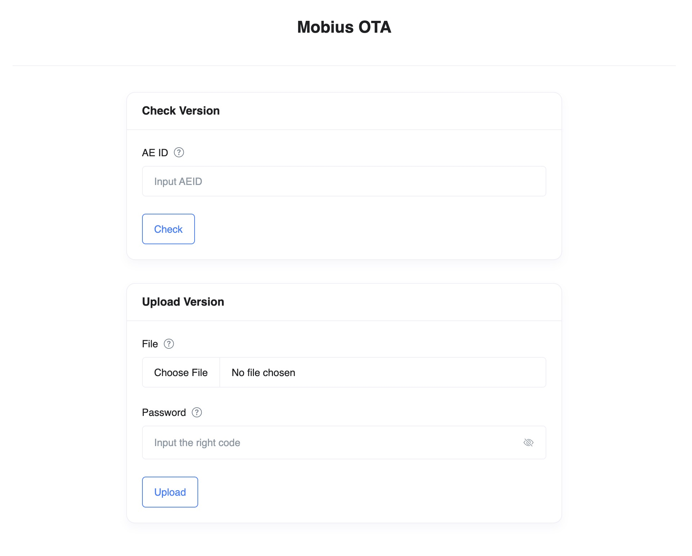

# mobius-ota
Mobius OTA - description

## Getting Started

```sh
# clone it
git clone https://github.com/sistechai/mobius-ota.git
cd mobius-ota
```

### Install dependencies:
```sh
npm install or yarn
```

### Set environment variables:

```sh
cp .env.example .env
```

### Run
```sh
# start server
npm run dev or yarn dev
```
Server listening on http://127.0.0.1:7580, in development mode



### Build for production

```sh
npm run build or yarn build
```

## Routes

```js
@route GET /fw/:aeid/version
@route GET /fw/:aeid/:version/size
@route GET /fw/:aeid/:version/download
@route GET /fw/:aeid/:version/data/block?seq=:k

@route POST /fw/:aeid/rawfile

```
  
### Get Last Firmware Version:
```js
/**
 * This function responding with the firmware version as character string
 * @route GET /fw/:aeid/version
 * @param { string } aeid.required - Application Entity ID
 */
```

```sh
curl -X GET http://127.0.0.1:7580/fw/:aeid/version -i
```

It will return something like:
```sh
HTTP/1.1 200 OK
...
version
```

### Get Last Firmware Size:
```js
/**
 * This function responding with the firmware file size
 * @route GET /fw/:aeid/:version/size
 * @param { string } aeid.required - Application Entity ID
 * @param { string } version.required - Firmware version
 */
```

```sh
curl -X GET http://127.0.0.1:7580/fw/:aeid/:version/size -i
```

It will return something like:
```sh
HTTP/1.1 200 OK
...
size
```

### Download Last Firmware:
```js
/**
 * This function responding with the firmware file
 * @route GET /fw/:aeid/:version/download
 * @param { string } aeid.required - Application Entity ID
 * @param { string } version.required - Firmware version
 */
```

```sh
curl -X GET http://127.0.0.1:7580/fw/:aeid/:version/download -i
```

It will return something like:
```sh
HTTP/1.1 200 OK
Content-Type: application/octet-stream
Content-Length: Size
...
file
```

### Get k-th Block of The Firmware File:
```js
/**
 * This function responding with the file contents of the k-th block of the firmware file
 * @route GET /fw/:aeid/:version/data/block
 * @param { string } aeid.required - Application Entity ID
 * @param { string } version.required - Firmware version
 * @param { string } seq.query.required - k-th block
 */
```

```sh
curl -X GET "http://127.0.0.1:7580/fw/:aeid/:version/data/block?seq=:k" -i
```

It will return something like:
```sh
HTTP/1.1 200 OK
Content-Type: application/octet-stream
Content-Disposition: attachment; filename=fragment:k
Access-Control-Expose-Headers: Is-Next, Seq
Content-Length: BufferSize
Seq: k
...
buffer
```

### Upload Firmware Raw Data:
```js
/**
 * This function saving the uploaded file into a data folder with the filename provided
 * @route POST /fw/:aeid/rawfile
 * @param { string } aeid.required - Application Entity ID
 * @property { file } file.required - Raw data file
 */
```

```sh
curl -X POST http://127.0.0.1:7580/fw/:aeid/rawfile -F "file=@data.log" -i
```

It will return something like:
```sh
HTTP/1.1 200 OK
...
{"message":"Successfully uploaded!"}
```
